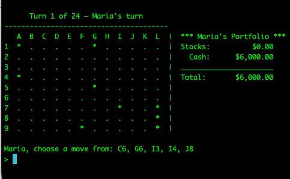
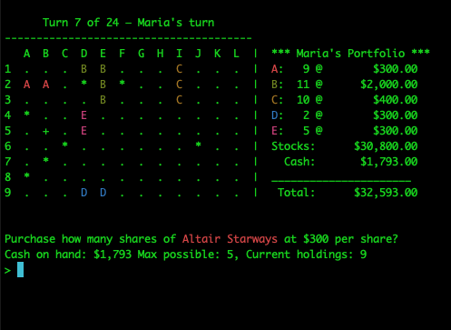

# TRADE.BAS




A modern Python re‑implementation of the classic 1970s/80s BASIC game
originally distributed as `TRADE.BAS` with the Kaypro II (and other systems).

The game plays like I recall the original, though there are a few modifications to the display and game commands that (I think) make it a bit smoother of an experience while still preserving the feel of the classic game. I also added an option for computer-controlled players that was not in the original BASIC game.

When I started this some years ago, this was a chance to work on my coding skills and expand my use of Python. In picking it back up recently (2026) it became a chance to explore agent coding. Much of the code, while based on my original port from BASIC, has been revised, rewritten, or expanded by coding agents.

## Game Name and History

*Star Lanes* was the title used in the original [1977 *Interface Age* publication
by Steven Faber](<BASIC_code_files/Star Lanes code original publication in Interface magazine.pdf>).

*[Star Traders](https://en.wikipedia.org/wiki/Star_Trader)* is an alternate name applied to the game at times, though the original (and subsequent) *Star Traders* games were a more-RPG style space-trading adventure (see linked article above).

## Gameplay Summary

A tile-placement stock purchasing game for 1 - 4 players. Players can compete against each other or the computer, and the computer-controlled players can be set to Beginner, Intermediate, or Advanced skill levels. Players place tiles on a grid to found companies, expand their territories, trigger mergers, and accumulate the highest net worth by game end.

- The map is a 9x12 grid (A-L columns, 1-9 rows).
- Each turn offers 5 legal moves, chosen at random by the computer.
- Moves can create outposts, found companies (if an outpost is placed next to another outpost or a star), expand companies (if placed next to an existing company), or trigger mergers (if two or more companies will be connected by the new placement).
- Dividends - fixed at 5% of the stock's share value - are paid before purchases each turn.
- Stock splits occur when share price crosses the split threshold (original set at $3000).
- The number of turns depends on the number of players - solo play is 49 turns, two players will have 24 turns, three players will have 16, and four players will have 12.
- The winner is the player with highest net worth (stock value plus cash) at the end.

## A few updates from the original...

- *Mergers*: In the original, if two companies were merging and they were tied in terms of outposts, the company alphabetically first would win. I tweaked this so that the oldest company survives.

- *Colors:* While the original incarnations of the game would all have been in monochrome, this version does use a colorized mode as default, where company symbols and names are rendered in color. (See below in command line args for how to tweak color modes to match your preferred retro nostalgia scheme, should you so desire.)

- *Display:* The original version printed only the map each turn, with a special command to display a player's portfolio. This version adds an updated portfolio to the right of the map, so there is no "Display Portfolio" or "Display Map" command. Similarly, the stock purchasing display is tweaked to confirm the previous purchase (or lack thereof) for player reference.

- *Computer players:* The original BASIC code had no automated players. This version features the option to have one or more opponents be controlled by the computer at three levels of skill. Number and ability of computer players is set by the user during game startup.

## Strategy

Winning this game is all about making smart choices with your money and planning ahead. Dividends, which are 5% of a stock's value, give you extra cash every turn. To make the most of this, invest in companies that are likely to grow quickly. Bigger dividends come from higher stock prices, so buying shares early can really pay off. However, don’t spend all your money—keep some cash ready for new opportunities.

Mergers are another big way to boost your wealth. When two companies merge, the shareholders of the smaller company get a bonus based on how many shares they own. This means it’s smart to invest in companies that might get bought out, especially if you can help make the merger happen by placing tiles. Stock splits are also important. When a company’s stock price gets too high (over $3000), the price is cut in half, but you get twice as many shares. This makes the stock easier to buy and can attract more players. By using dividends for steady income, mergers for big bonuses, and stock splits for long-term growth, you can build a strong portfolio and win the game.

See [strategy.md](docs/strategy.md) for a fuller description of how the computer makes decisions, and how this might impact your strategy as a player.


## Quick Start

Requires **Python 3.11 or later**.

**Platform Support:**

- **Linux and macOS**: Uses the `blessings` terminal backend (full color and formatting support via curses)
- **Windows**: Uses the Windows terminal backend with `colorama` for color support (ANSI emulation)

### Linux and macOS

1. Create and activate a virtual environment:

```bash
python3 -m venv .venv
source .venv/bin/activate
```

2. Install dependencies:

```bash
python3 -m pip install -r requirements.txt
```

3. Run the game:

```bash
python3 trade_main.py
```

### Windows

1. Create and activate a virtual environment:

```cmd
python -m venv .venv
.venv\Scripts\activate
```

2. Install dependencies:

```cmd
python -m pip install -r requirements.txt
```

3. Run the game:

```cmd
python trade_main.py
```

## Runtime Flags

### Command-Line Arguments

- `--monochrome`: Disable ANSI color output. Useful for terminals with limited color support.

  ```bash
  python3 trade_main.py --monochrome
  ```

- `--color-scheme {default,green,amber,white}`: Select a foreground color. In keeping with the retro nature of the game, users can specify (`green`, `amber`, `white`).

  ```bash
  python3 trade_main.py --color-scheme amber
  ```

- `--show-ai-thinking {off,summary,detailed}`: Controls optional computer reasoning visibility during interactive games with at least one human player.

  - `off`: no additional reasoning details (default).
  - `summary`: appends top scoring factors to the computer turn status line.
  - `detailed`: keeps the map on screen and prints ranked AI analysis below the map and portfolio.

  ```bash
  python3 trade_main.py --show-ai-thinking summary
  ```

For regular gameplay you can safely ignore these subsequent flags, as they are used almost exclusively for development.

- `--headless`: Run in non-interactive autoplay mode suitable for CI/smoke runs.

  ```bash
  python3 trade_main.py --headless
  ```

  Headless is authoritative: it enforces `autopilot=true`, `interactive=false`, and `pause-at-end=false`.
  Do not combine `--headless` with explicit mode flags (below).

- `--autopilot {true,false}`: Enable or disable automatic move and stock selection. When set to true startup prompts are skipped and the game currently launches as a 2-seat computer-only game at Beginner difficulty.

- `--interactive {true,false}`: Enable or disable interactive prompts.

- `--pause-at-end {true,false}`: Control whether the game waits for input before exiting. This allows an autopilot game to run to completion, and allow you to scroll back in your terminal to review the changing game state (useful for checking display or other game behaviors).

When starting from interactive setup, this can also be selected in-program after computer difficulty prompts.

## Running Tests

Interested in modifying the game? Here is the key info on the current testing suite:

From repository root:

**Linux and macOS:**

```bash
python3 -m pytest -q
```

**Windows:**

```cmd
python -m pytest -q
```

Both commands run the same test suite. Pytest discovery is restricted by `pytest.ini` to the tests directory.

**Platform-Specific Notes:**

- On Windows, tests for the `blessings` terminal backend are automatically skipped (blessings requires curses, which is unavailable on Windows).
- On Unix-like systems, the Windows terminal backend tests run normally.
- All platform-specific test skips are controlled by `@pytest.mark.skipif` decorators in the test files.

## Project Layout

- `trade_main.py`: terminal entry point and top-level loop.
- `trade_objects.py`: core domain model (Game, Company, Player, Map, Display).
- `ai_strategies.py`: computer move-selection and stock-purchase strategy implementations.
- `terminal/`: platform-specific terminal backends (Windows and Blessings for Unix-like systems).
- `tests/`: rule and terminal behavior tests. See [tests/tests.md](tests/tests.md).
- `docs/`: behavioral contracts and invariants. See [docs/README.md](docs/README.md).
- `BASIC_code_files/`: original BASIC source, preserved as reference. See [BASIC_code_files/README.md](BASIC_code_files/README.md).

## License

This project is licensed under the MIT License. See the LICENSE file for details.

The original BASIC source code and accompanying publication are included for historical reference. Their original copyright status is preserved.
